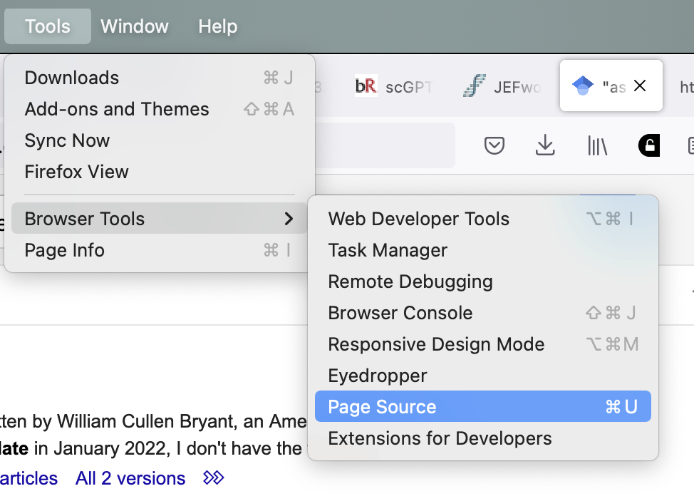

```{r include=FALSE}
# library(xaringanthemer)
# xaringanthemer::style_mono_light(
  ##  base_color = "#0092AC",
  # header_font_google = google_font("IBM Plex Sans", "600"),
  # text_font_google   = google_font("IBM Plex Sans", "300", "300i"),
  # code_font_google   = google_font("IBM Plex Mono")
# )
```

## It's not gonna be a walk of shame, I promise

--

Raise your hand if you...

--

-   ... have used ChatGPT/any LLM (at all)

--

-   ... have used ChatGPT/any LLM for your scientific work

--

-   ... have used ChatGPT/any LLM for your daily work in science

--

Don't worry, you might not be alone

<p align="center">

</p>

https://www.economist.com/science-and-technology/2024/06/26/at-least-10-of-research-may-already-be-co-authored-by-ai

---

## What did you use it for?

--

So far I have seen it used/used it for...

--

* Drafting text - with and without a prompt/context specification (well refined or not)

--

* Obtaining review-like summaries

--

* Suggesting related literature (some specific LLMs can do a much better job, e.g. ResearchRabbit)

--

* Translate and refine drafts of paragraphs

---

## LLMs are already changing the way we do things

--

Some researchers set out to understand how - and how to detect that

--

<p align="center">

</p>

https://arxiv.org/abs/2403.07183

--

* Examined text at the corpus level (expert-generated vs AI-generated)
* 6.5%-16.9% could be *substantially modified* by LLMs
* Patterns of usage emerged - last minute panic anyone?

---

## LLMs are already changing the way we do things

Some researchers set out to understand how - and how to detect that

<p align="center">

</p>

https://arxiv.org/abs/2406.07016

--

* Vocabulary changes in 14 million PubMed abstracts - increase in the frequency of certain style words
* At least 10% of 2024 abstracts were processed with LLMs

> Initially, we **delve** into the **intricacies** of […], **accentuating** its indispensability in cellular physiology, the enzymatic labyrinth governing its flux, and the **pivotal** […] mechanisms.

---

## The omics world was not too slow on hopping on this

--

<p align="center">

</p>

https://www.nature.com/articles/s41592-024-02235-4

--

* GPT-4 can accurately annotate cell types using marker gene information in single-cell RNA sequencing analysis
* Strong concordance with manual annotations
* Undisclosed nature of GPT-4's training corpus makes verifying the basis of its annotations challenging

--

No free meal: "We recommend validation of GPT-4's cell type annotations by human experts before proceeding with downstream analyses"

---

## The omics world was not too slow on hopping on this

<p align="center">

</p>


https://www.nature.com/articles/s41592-024-02201-0 - https://scgpthub.org/

--

* Texts comprise words; similarly, cells are defined by genes
* Constructed a foundation model for single-cell biology [...] across a repository of over 33 million cells
* Applicable in tasks such as cell type annotation, multi-batch integration, multi-omic integration, perturbation response prediction
* Evaluating the model is complex, given the frequent absence of definitive biological ground truths and the variation in data quality

---

## Sometimes, things can go south

What can go wrong there - in the most blatant case?

--

> Certainly, here is a possible introduction for your topic

--

> as an AI language model

--

> I don’t have access to real-time data

--

> as of my last knowledge update

--

**These sentences are just left inside the final version of the manuscripts!**

Nope, not caught by authors, nor by reviewers, nor by editors.  
<!-- I could start a rant on the ADDED VALUE of the peer reviewing process through journals but I will not, at least not today -->

---

## Can we quantify this "things going south"?

--

Google Scholar + R (`rvest`)

--

Who is using Google Scholar already?

--

I needed to understand **how the queries work** there

--

I needed to understand **how to do web scraping**

--

I might need to **write a function or two** to do that in a streamlined manner

---

## How do the queries work?

--

<p align="center">

</p>

--

<p align="center">

</p>

---

## How do the queries work?

<p align="center">

</p>

--

<p align="center">

</p>

---

## How do the queries work?

<p align="center">

</p>

--

<p align="center">

</p>

---

## How do I do the web scraping?

--

Use the source, Luke

<p align="center">

</p>

--

<p align="center">

</p>

---

## How do I do the web scraping?

`https://scholar.google.com/scholar?q=%22as+of+my+last+knowledge+update%22+-%22ChatGPT%22&as_ylo=2022&as_yhi=2024`

--

```{r firstscrape}
library("rvest")
url <- "https://scholar.google.com/scholar?q=%22as+of+my+last+knowledge+update%22+-%22ChatGPT%22&as_ylo=2022&as_yhi=2024"
page <- read_html(url)
page
```

--

<p align="center">

</p>

---

## How do I do the web scraping?

```{r fetchnode}
results <- page |> 
  html_nodes(".gs_ab_mdw") |> 
  html_text()
results 
```

--

```{r regex}
library("stringr")
number_string <- str_extract(results[2], "[0-9,.]+")
# Remove commas and dots
clean_number_string <- str_replace_all(number_string, "[,.]", "")
# Convert to numeric
numeric_value <- as.numeric(clean_number_string)
numeric_value
```

---

## How do I put it all together?

```{r overyears}
years <- seq(2018, 2024)
query_text <- "single+cell+transcriptomics"

number_pubs <- sapply(years, function(year) {
  url <- paste0(
    "https://scholar.google.com/scholar?q=%22", query_text, 
    "%22+-%22ChatGPT%22&as_ylo=", year, "&as_yhi=", year + 1)
  page <- read_html(url)
  results <- page |> 
    html_nodes(".gs_ab_mdw") |> 
    html_text() 
  
  numpubs <- stringr::str_extract(results[[2]], "[0-9,.]+") |> 
    stringr::str_replace_all("[,.]", "") |> 
    as.numeric()
  return(numpubs)
}) 
number_pubs
```

---

## How do I put it all together?

```{r fetchfunction}
query_text <- "single+cell+transcriptomics"
years <- seq(2018, 2024)

fetch_nr_pubs <- function(query_text, year_range) {
  number_pubs <- sapply(year_range, function(year) {
    url <- paste0(
      "https://scholar.google.com/scholar?q=%22", query_text, 
      "%22+-%22ChatGPT%22&as_ylo=", year, "&as_yhi=", year + 1)
    page <- read_html(url)
    results <- page |> 
      html_nodes(".gs_ab_mdw") |> 
      html_text() 
    
    numpubs <- stringr::str_extract(results[[2]], "[0-9,.]+") |> 
      stringr::str_replace_all("[,.]", "") |> 
      as.numeric()
    return(numpubs)
  }) 
  info_pubs <- cbind(years = year_range, numpubs = number_pubs, 
                     query = query_text)
  return(info_pubs)
}
```

---

## How do I put it all together?

```{r runfetch, eval = FALSE}
q1 <- fetch_nr_pubs(query_text = "as+of+my+last+knowledge+update",
                    year_range = years)
q2 <- fetch_nr_pubs(query_text = "as+an+AI+language+model",
                    year_range = years)
q3 <- fetch_nr_pubs(query_text = "single+cell+transcriptomics",
                    year_range = years)
q4 <- fetch_nr_pubs(query_text = "spatial+transcriptomics",
                    year_range = years)
q5 <- fetch_nr_pubs(query_text = "transcriptomics",
                    year_range = years)
q6 <- fetch_nr_pubs(query_text = "due+to+COVID",
                    year_range = years)

df <- data.frame(rbind(q1, q2, q3, q4, q5, q6))

df$years <- as.numeric(df$years)
df$numpubs <- as.numeric(df$numpubs)
df$ind <- 1:nrow(df)

# adjust for 2024, times 2
df$numpubs[df$years == "2024"] <- df$numpubs[df$years == "2024"] * 2
```

```{r loaddf, include=FALSE}
df <- readRDS("pubs_df.RDS")
```

---

## How do I put it all together?

.pull-left[
```{r plotgg, warning=FALSE, eval=FALSE}
library("ggplot2")

p <- ggplot(df, aes(x = years, 
                    y = numpubs, 
                    col = query)) +
  geom_line(linewidth = 2) + 
  scale_y_log10() + 
  theme_bw()
p
```
] 

--

.pull-right[
```{r plotgg-out, ref.label="plotgg", echo=FALSE, message=FALSE, warning=FALSE}
```
]

---

## How do I put it all together?

.pull-left[
```{r plotanim, warning=FALSE, message=FALSE, eval=FALSE}
library("gganimate")

anim <- p + 
  view_follow(fixed_x = TRUE) +
  geom_point(size = 4) +
  transition_reveal(ind) 

anim
```
] 

--

.pull-right[
```{r plotanim-out, ref.label="plotanim", echo=FALSE, message=FALSE, warning=FALSE}
```
]

---

## Will we change our ways?

<blockquote class="twitter-tweet"><p lang="en" dir="ltr">ChatGPT uses words &quot;delve&quot;, &quot;intricate&quot;, &quot;meticulous&quot;, &quot;underscore&quot;, &quot;showcase&quot; etc. much more often than the average human academic writer.<br><br>Knowing this, are you going to use these words more often (adapt to the new norm) or less often (avoid sounding like LLM) yourself?</p>&mdash; Dmitry Kobak (@hippopedoid) <a href="https://twitter.com/hippopedoid/status/1804510939514818907?ref_src=twsrc%5Etfw">June 22, 2024</a></blockquote> <script async src="https://platform.twitter.com/widgets.js" charset="utf-8"></script> 

<!-- https://x.com/hippopedoid/status/1804510939514818907 -->

---

## Will we change our ways? (Episode 2)

<blockquote class="twitter-tweet"><p lang="en" dir="ltr">Seems like it won’t matter much one way or another because there will apparently be no readers of the papers one writes. <a href="https://t.co/ZD4wJlM8A9">https://t.co/ZD4wJlM8A9</a></p>&mdash; Lior Pachter (@lpachter) <a href="https://twitter.com/lpachter/status/1804521011515437071?ref_src=twsrc%5Etfw">June 22, 2024</a></blockquote> <script async src="https://platform.twitter.com/widgets.js" charset="utf-8"></script> 

<!-- https://x.com/lpachter/status/1804521011515437071 -->

---

## You might have heard of this...

.pull-left[

```{r echo=FALSE}
library("ggplot2")
horse_df <- data.frame(
  horse = seq(0, 100, 20),
  rocket = seq(0, 100, 20)
)
ggplot(horse_df, aes(x = horse, y = rocket)) + geom_point() + theme_minimal() + 
  labs(
    x = "Horse's ass",
    y = "Size of the space shuttle rockets"
  )
```

]

--

.pull-right[

> The reason LLMs say "delve" is apparently that RLFH was performed by workers in Nigeria, where words like "delve" are much more frequently used in business English than it is in England or the US

https://www.theguardian.com/technology/2024/apr/16/techscape-ai-gadgest-humane-ai-pin-chatgpt

<p align="center">

</p>

]

---

## My two cents on this

--

* LLM models are out there, and are being used - excelling in some tasks, less in others

--

* Hundreds of published research papers might just be copy-pasted content from LLM models, yet they are a small percent of the published corpus

--

* Publish-or-perish pressure again? Time pressure, limited resources $\rightarrow$ dubious use of LLM models

--

* Institutions, funding agencies, peer reviewers, and researchers themselves need to work on  mechanisms for promoting a culture of integrity in scientific publishing

--

* They are not (just) ((pure)) evil - A considerate usage can be beneficial in some things we do

--

* A temporary error `Response code 429` means that Google is rate limiting you for making too many requests too quickly

--

[`https://github.com/federicomarini/AhiAhiAI`](https://github.com/federicomarini/AhiAhiAI)

---

class: middle, center

[`https://github.com/federicomarini/AhiAhiAI`](https://github.com/federicomarini/AhiAhiAI)

## ... thank you for your attention!

